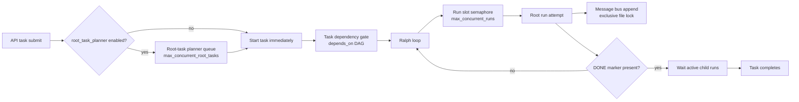

# Concurrency Architecture

This page describes how concurrency is controlled in Conductor Loop today.

Implementation grounding:
- `internal/runner/ralph.go`
- `internal/runner/semaphore.go`
- `internal/runner/task.go`
- `internal/api/root_task_planner.go`
- `internal/messagebus/messagebus.go`
- `internal/messagebus/lock.go`
- `internal/taskdeps/taskdeps.go`

## Concurrency Model

## Ralph Loop: Restart, DONE, Max Restarts

`RalphLoop.Run()` is the root retry loop.

Key semantics:
- `DONE` is checked before starting each attempt and again right after each attempt.
- If `DONE` exists, no new root attempt is started.
- Default loop settings are:
  `maxRestarts=100`, `restartDelay=1s`, child wait timeout `300s`, child poll interval `1s`.
- Attempt numbers start at `0` (`"starting root agent (restart #0)"`).
- The loop exits with error when `restarts >= maxRestarts` before launching the next attempt.

`DONE` behavior:
- `DONE` must be a file; `DONE` as a directory is treated as an error.
- On `DONE`, the loop calls `handleDone()`:
  - Finds active child runs.
  - If none are active: completes immediately.
  - If active children exist: waits for them up to `waitTimeout`.
  - If child wait times out: writes a warning and returns success (no further restart).
  - If child wait fails for another reason: returns error.

## Run Concurrency Limit: `max_concurrent_runs`

Run-level admission is guarded by a package semaphore in `internal/runner/semaphore.go`.

Behavior:
- `initSemaphore(n)` is one-shot; only the first call applies.
- `n > 0`: bounded buffered channel semaphore.
- `n <= 0`: unlimited concurrency (no semaphore).
- `acquireSem(ctx)` blocks until a slot is available or context is canceled.
- `releaseSem()` releases one slot.

Queued-run tracking:
- `queuedRunsGauge` counts runs waiting for a slot.
- The gauge increments before waiting and decrements when a waiter acquires a slot or exits on cancellation.
- `SetWaitingRunHook` publishes `+1/-1` deltas for metrics integration.

Operational implication:
- If all slots are in use, new runs queue in-process and can be observed via queued-run metrics.

## Root-Task Planner FIFO Queue: `max_concurrent_root_tasks`

When `max_concurrent_root_tasks > 0`, API-created root tasks are admitted through `rootTaskPlanner`.

State and ordering:
- Planner state is persisted at `<root>/.conductor/root-task-planner.yaml`.
- Each entry gets a monotonically increasing `Order` (`NextOrder`), then queued/running state.
- Scheduling order is FIFO by `Order` (with deterministic tie-breakers).

Capacity model:
- `scheduleLocked()` computes `available = limit - runningCount`.
- `runningCount` includes:
  - planner entries marked `running`, and
  - externally discovered running root runs from `run-info.yaml` scan (prevents oversubscription).
- Up to `available` queued entries are promoted to running and returned as launches.

Queue lifecycle:
- `Submit()` either starts immediately (`status=started`) or queues (`status=queued`, `queue_position`).
- `OnRunFinished*()` removes finished running entries and promotes queued entries.
- `Recover()` reconciles persisted planner state and reschedules after server restart.

Recovery details:
- Missing `run-info.yaml` for a `running` entry is tolerated briefly (`5s` grace).
- After grace, stale running entries are re-queued.
- Completed/failed root runs are removed from planner occupancy.
- Queued entries for tasks already marked `DONE` are dropped.
- Planner writes are atomic (temp file + sync + rename).

## Message Bus Lock Contention and Retry/Backoff

`AppendMessage()` serializes writes with an exclusive file lock.

Locking model:
- Writer opens bus file with `O_APPEND`.
- `LockExclusive(file, timeout)` attempts non-blocking lock repeatedly every `10ms` until timeout.
- Default lock timeout: `10s`.
- On success, one append operation executes under the lock.

Retry model:
- Default append attempts: `3` (`maxRetries`).
- Retries happen only on lock-timeout failures.
- Backoff is exponential: `retryBackoff * 2^(attempt-1)` with default base `100ms`.
- Non-lock errors fail immediately.

Contention observability:
- `ContentionStats()` exposes total attempts and retries.

Platform note:
- On Unix-like systems this is advisory file locking.
- On Windows this is mandatory byte-range locking, so reads can block behind active writer locks.

## Task Dependency DAG, Cycle Detection, and Gating

Dependencies are maintained in `TASK-CONFIG.yaml` as `depends_on`.

Graph validation:
- `Normalize()` trims, splits comma-separated values, de-duplicates, validates IDs, and rejects self-dependency.
- `ValidateNoCycle()` builds the project dependency graph and runs DFS cycle detection.
- On cycle, task start/config update is rejected (`dependency cycle detected: ...`).

Runtime gating:
- `RunTask()` resolves dependencies before entering Ralph loop.
- `waitForDependencies()` polls unresolved dependencies (default interval `2s`).
- A dependency is ready when:
  - dependency task has `DONE`, or
  - its latest run is `completed` and no run is currently `running`.
- While blocked, task bus receives `PROGRESS` with current blockers.
- When all blockers clear, task bus receives `FACT` and task execution proceeds.
- If the current task gets `DONE` while waiting, dependency wait exits immediately.

## Failure and Recovery Summary

- Root run crashes/failures: Ralph loop retries until `maxRestarts`; then fails fast with error.
- `DONE` with active children: waits; timeout is downgraded to warning and task still completes.
- Run-slot pressure: excess runs wait on semaphore; queued gauge tracks in-flight waiters.
- Root-task oversubscription risk: planner counts both persisted running entries and externally running root runs before admitting more.
- Planner state drift/stale entries: `reconcileLocked()` re-queues stale running entries after grace and removes terminal ones.
- Message bus lock contention: append retries with exponential backoff on lock timeouts; exhausts with explicit failure.
- Dependency graph errors: cycle detection blocks invalid dependency updates before execution.
