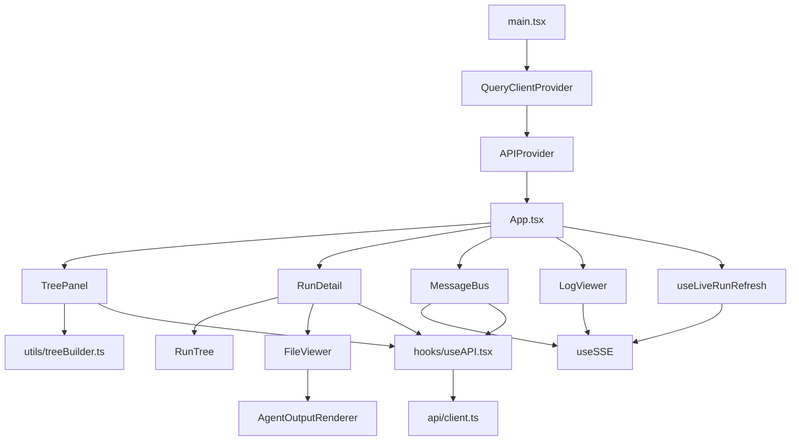
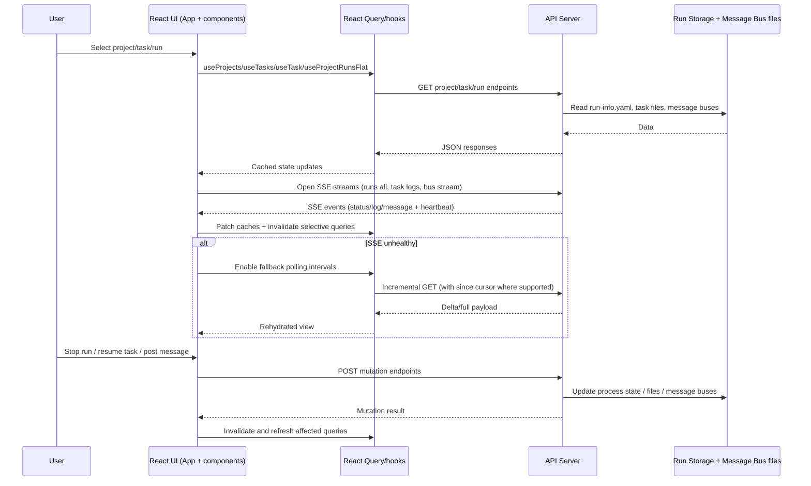

# Frontend Architecture

## Scope
This page documents the current web UI architecture implemented in:
- `frontend/package.json`
- `frontend/src/App.tsx`
- `frontend/src/api/client.ts`
- `frontend/src/hooks/useSSE.ts`
- `frontend/src/components/*`
- `internal/api/routes.go`
- `internal/api/sse.go`
- `README.md`

## Stack
- Framework: React 18 (`react`, `react-dom`)
- Language: TypeScript 5
- UI library: JetBrains Ring UI (`@jetbrains/ring-ui-built`)
- Build tool: Vite 7 (`vite`, `@vitejs/plugin-react`)
- Data/cache layer: TanStack React Query (`@tanstack/react-query`)
- Streaming: browser `EventSource` (SSE) via `useSSE`

## Build and Asset Serving
- Frontend build command is `tsc -b && vite build` (`frontend/package.json`).
- Vite default output is `frontend/dist`.
- Server-side UI file system resolution (`internal/api/routes.go`):
  - Preferred: filesystem `frontend/dist` (must contain `index.html`).
  - Fallback: embedded assets from `web/src` via `web.FileSystem()`.
- Route mount behavior:
  - `/ui/` serves the UI.
  - `/ui` redirects to `/ui/`.
  - `/` also serves the UI file server when UI assets are available.
- README states the same deployment model: built `frontend/dist` first, embedded `web/src` fallback when dist is missing.

## Runtime Composition
- `main.tsx` wires:
  - `QueryClientProvider`
  - `APIProvider` (injects `APIClient`, base URL from `VITE_API_BASE_URL` or empty string)
  - `App`
- `App.tsx` is the shell/state coordinator with three primary task tabs:
  - `Task details` -> `RunDetail`
  - `Message bus` -> `MessageBus`
  - `Live logs` -> `LogViewer`
- Left navigation panel is `TreePanel` (project/task/run selection and create dialogs).

### Component Map

## Data Access Model

### HTTP Client Layer
`APIClient` centralizes fetch logic:
- Adds `X-Conductor-Client: web-ui`.
- Parses JSON and normalizes API errors (`api <status>: 
`).
- Supports `204` responses.
- Uses encoded path parameters throughout.

Primary data reads used by the UI:
- `GET /api/projects`
- `GET /api/projects/{project}`
- `GET /api/projects/{project}/tasks?limit&offset`
- `GET /api/projects/{project}/tasks/{task}`
- `GET /api/projects/{project}/tasks/{task}/runs/{run}`
- `GET /api/projects/{project}/tasks/{task}/file?name=TASK.md`
- `GET /api/projects/{project}/tasks/{task}/runs/{run}/file?name=<...>&tail=<...>`
- `GET /api/projects/{project}/runs/flat?...`
- `GET /api/projects/{project}/messages?since&limit`
- `GET /api/projects/{project}/tasks/{task}/messages?since&limit`
- `GET /api/projects/{project}/stats`
- `GET /api/projects/home-dirs`
- `GET /api/v1/version`

Primary mutating calls used by the UI:
- `POST /api/projects`
- `POST /api/v1/tasks` (task start/create)
- `POST /api/projects/{project}/tasks/{task}/runs/{run}/stop`
- `POST /api/projects/{project}/tasks/{task}/resume`
- `POST /api/projects/{project}/messages`
- `POST /api/projects/{project}/tasks/{task}/messages`

### Query/Cache Layer
`hooks/useAPI.tsx` wraps `APIClient` with React Query.

Patterns:
- Resource-scoped query keys (`['tasks', projectId]`, `['task', projectId, taskId]`, etc.).
- Targeted invalidation after mutations (for example stop/resume/task-create).
- Periodic refresh where needed:
  - Project stats: every 10s.
  - Runs flat: dynamic interval based on active runs and stream health.
- Cache stabilization/merge helpers avoid unnecessary rerenders and preserve lineage context for run trees.

## SSE Subscription Model

### Generic Hook
`useSSE(url, options)` manages an `EventSource` connection and exposes:
- States: `disabled | connecting | open | reconnecting | error`
- Error count
- Named event handler registration (`events` map)

### Streams Used by the UI
1. Global run status stream (tree/detail invalidation):
- Endpoint: `GET /api/v1/runs/stream/all`
- Consumer: `useLiveRunRefresh`
- Event usage:
  - `status`: patches run/task/run-info caches and schedules selective refetch.
  - `log`: detects unknown runs and triggers topology refresh when needed.

2. Message bus stream (project/task scope):
- Endpoints:
  - `GET /api/projects/{project}/messages/stream`
  - `GET /api/projects/{project}/tasks/{task}/messages/stream`
- Consumer: `MessageBus`
- Event usage:
  - `message`: parsed and batched into local message state.
- Resume semantics:
  - Backend emits SSE `id` as `msg_id`.
  - Stream handler accepts `Last-Event-ID` and resumes from that message.

3. Task runs log stream:
- Endpoint: `GET /api/projects/{project}/tasks/{task}/runs/stream`
- Consumer: `LogViewer`
- Event usage:
  - `log` (primary backend event from run stream fan-in).
  - `run_start`/`run_end` handlers exist in UI for compatibility, but backend stream logic is status/log based.
- Resume semantics:
  - Run log events carry cursor IDs (`s=<stdout>;e=<stderr>`).
  - Backend parses cursor-form `Last-Event-ID` to perform catch-up for missed lines.

4. Run file stream (`output.md`, stdout, stderr, prompt):
- Endpoint: `GET /api/projects/{project}/tasks/{task}/runs/{run}/stream?name=<file>`
- Consumer: `useRunFile`
- Behavior:
  - Incoming `message` chunks replace first payload then append subsequent chunks.
  - `done` closes stream and invalidates the query.

### SSE Fallback and Recovery Behavior
1. Message bus fallback:
- When stream state is not `open`/`connecting`, message queries poll every `3000ms`.
- Incremental fetch uses `since=<cached newest msg_id>`.
- If server returns `404 message id not found`, client retries without `since` (cursor reset).

2. Runs/topology fallback:
- `useProjectRunsFlat` always polls with dynamic intervals.
- Stream healthy (`open`): slower sync intervals.
- Stream unhealthy: faster polling (especially with active runs).

3. Run file fallback:
- For active runs, if stream is `error`/`disabled`, REST polling resumes (`2500ms`).
- Polling is suppressed while stream is healthy.

4. Log viewer fallback:
- No dedicated REST fallback loop in `LogViewer`; it reflects stream state (`connecting/reconnecting/error`) and keeps existing buffered lines.

## Key UI Features

### Task Tree
Implemented by `TreePanel` + `utils/treeBuilder.ts`:
- Project/task/run hierarchical view.
- Uses `/runs/flat` + `/tasks` for high-frequency tree reconstruction.
- Preserves cross-task lineage (`parent_run_id`, `previous_run_id`, thread parent metadata).
- Supports project creation and task creation (including `attach_mode` and `depends_on`).

### Message Bus Compose and View
Implemented by `MessageBus`:
- Project or task bus scope switching.
- Live stream + hydrated history merge.
- Text/type filters and render windowing for large feeds.
- Compose form posts new messages.
- Thread-aware actions:
  - Navigate to parent/child message context.
  - Create "answer in new task" linked through `thread_parent` metadata.

### Live Logs
Implemented by `LogViewer`:
- SSE-driven per-task logs.
- ANSI color conversion (`ansi-to-html`).
- Stream/run/search filters.
- Auto-scroll tracking and log export.
- Heartbeat-style recency badge based on last received log timestamp.

### Stop/Resume Controls
Implemented in `RunDetail`:
- Stop running agent: `POST .../runs/{run}/stop`.
- Resume task by clearing DONE marker: `POST .../tasks/{task}/resume`.
- Includes confirmations and status-aware visibility.

### Project Stats
Implemented by `ProjectStats` component + `useProjectStats` hook:
- Reads `GET /api/projects/{project}/stats`.
- Displays totals for tasks/runs, running/completed/failed, and message bus size.
- Refreshes periodically.

## API Interaction Map

| UI feature | Endpoint(s) |
| --- | --- |
| Project list/selection | `GET /api/projects`, `GET /api/projects/{project}` |
| Create project | `POST /api/projects` |
| Task list/detail | `GET /api/projects/{project}/tasks`, `GET /api/projects/{project}/tasks/{task}` |
| Create task | `POST /api/v1/tasks` |
| Run detail/files | `GET /api/projects/{project}/tasks/{task}/runs/{run}`, `GET /api/projects/{project}/tasks/{task}/runs/{run}/file`, `GET /api/projects/{project}/tasks/{task}/runs/{run}/stream` |
| Task metadata file | `GET /api/projects/{project}/tasks/{task}/file?name=TASK.md` |
| Stop/resume controls | `POST /api/projects/{project}/tasks/{task}/runs/{run}/stop`, `POST /api/projects/{project}/tasks/{task}/resume` |
| Message bus list/post | `GET/POST /api/projects/{project}/messages`, `GET/POST /api/projects/{project}/tasks/{task}/messages` |
| Message bus live stream | `GET /api/projects/{project}/messages/stream`, `GET /api/projects/{project}/tasks/{task}/messages/stream` |
| Live task logs | `GET /api/projects/{project}/tasks/{task}/runs/stream` |
| Global run status feed | `GET /api/v1/runs/stream/all` |
| Tree run topology | `GET /api/projects/{project}/runs/flat?active_only=1&selected_task_id=...&selected_task_limit=...` |
| Project stats | `GET /api/projects/{project}/stats` |
| Version badge | `GET /api/v1/version` |
| Home directory suggestions | `GET /api/projects/home-dirs` |

## Data-Flow Diagram

